## 目的

用于研究 webpack5 模块联邦特性及源码。

本仓库主要是暴露远程模块，供其他子应用消费。

## 说明

开发环境有太多干扰代码，为了方便阅读打包后的代码，需要修改 webpack 配置，mode 固定为'development'，然后关闭压缩 optimization.minimize = false

然后运行 yarn run build 打包代码

## 实践

### shared 共享依赖

默认情况下，在 shared 里面配置的依赖都会单独打包成一个独立的文件。以下面的配置为例

主应用 webpack 配置：

```js
output: {
  //...
  publicPath: '/', // publicPath会影响子应用加载远程脚本
  //...
}
//...
new ModuleFederationPlugin({
  name: "containerApp",
  filename: "remoteEntry.js",
  exposes: {
    "./Components": "./src/components/Button",
  },
  shared: {
    react: {
      singleton: true,
    },
    "react-dom": {
      singleton: true,
    },
  },
});
```

子应用配置：

```js
new ModuleFederationPlugin({
  remotes: {
    container: "containerApp@http://localhost:8081/remoteEntry.js",
  },
  shared: {
    react: {
      singleton: true,
    },
    "react-dom": {
      singleton: true,
    },
    axios: {},
    "js-cookie": {},
  },
});
```

主应用打包后的产物如下：

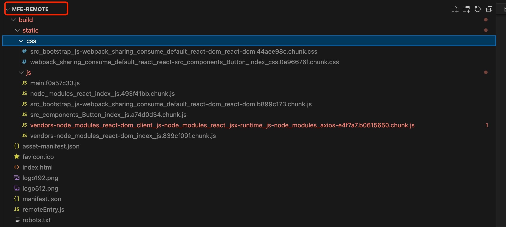

可以看到，react、react-dom 都被打包成单独的 chunk 文件 node_modules_react_index_js 以及 vendors-node_modules_react-dom_index_js。同时，exposes 里面的 Components 也被打包成独立的 chunk 文件 src_components_Button_index_js

子应用打包后的产物如下：

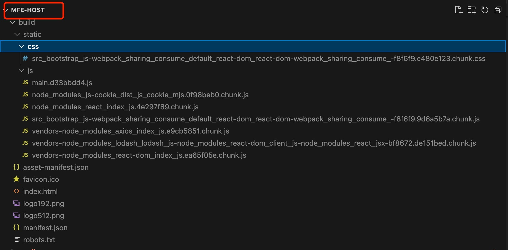

可以看到 react、react-dom、axios、js-cookie 分别被打包成独立的 chunk 文件 node_modules_react_index_js、vendors-node_modules_react-dom_index_js、vendors-node_modules_axios_index_js、node_modules_js-cookie_dist_js_cookie_mjs

打开浏览器，查看主应用控制台网络请求，如下：

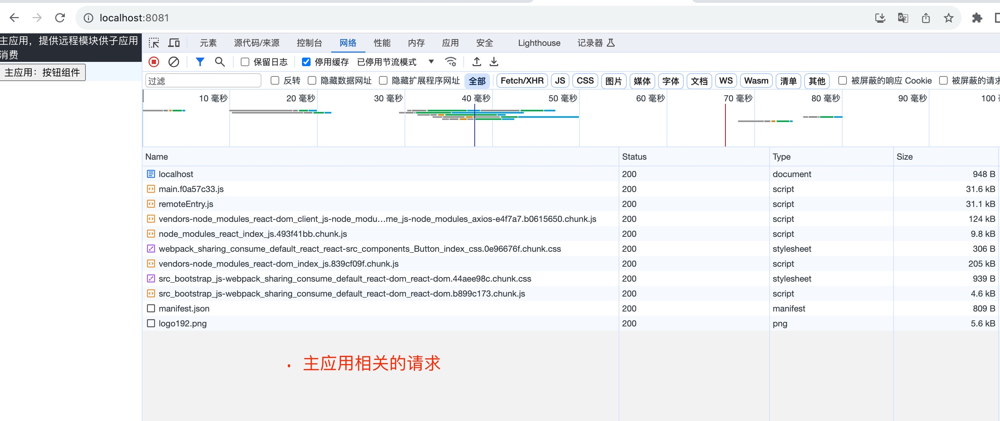

可以发现主应用也请求了 remoteEntry 文件，实际上主应用在打包时，会默认把 remoteEntry 打包到 index.html 文件里面。即使删除这个请求，也不会影响主应用的运行。

再看看子应用控制台网络请求，如下：

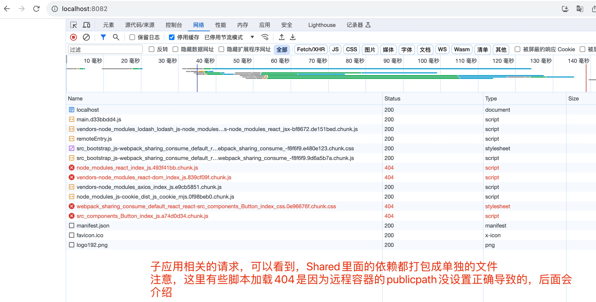

上面请求 404 的脚本实际上都是子应用请求的主应用的脚本，这些请求都是在 remoteEntry.js 脚本中发起的。但是由于主应用的 publicPath 没有设置正确，导致这些请求都代理到了自应用，子应用没有这些脚本，请求肯定都是 404。我们暂且不管 404 的请求。思考另一个问题：我们在子应用的 shared 配置里面配置了四个共享依赖 react、react-dom、axios、js-cookie。为啥 react、react-dom 请求出错，而 js-cookie、axios 的请求却正常？

要回答这个问题，我们需要先来看下子应用的 main 文件请求

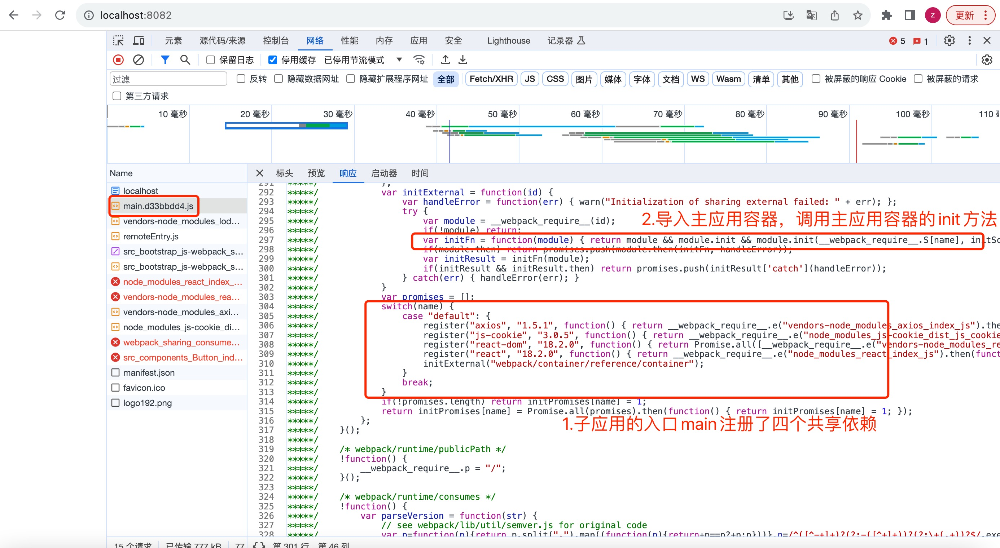

在子应用的 main 文件中，会首先注册 4 个共享依赖，然后调用 initExternal 加载主应用的 remoteEntry.js，并调用主应用的 init 方法。remoteEntry.js 的 init 逻辑如下：

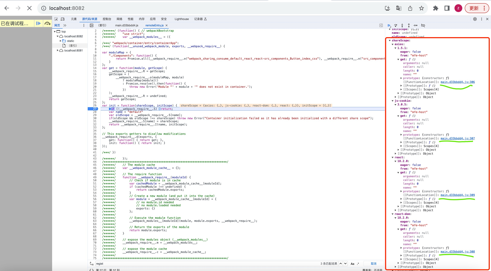

可以看到，init 方法中的 sharedScope 是子应用的 main.js 传递过来的参数，也是我们在子应用 webpack 配置里面定义的 shared 依赖，其结构如上图所示。这里需要特别注意每个依赖都有一个 get 方法，这个 get 方法默认都是在 main.js 中定义的。同时在 init 方法中，还通过**webpack_require**.S[name] = shareScope 将子应用的共享依赖挂在 remoteEntry 的**webpack_require**上。

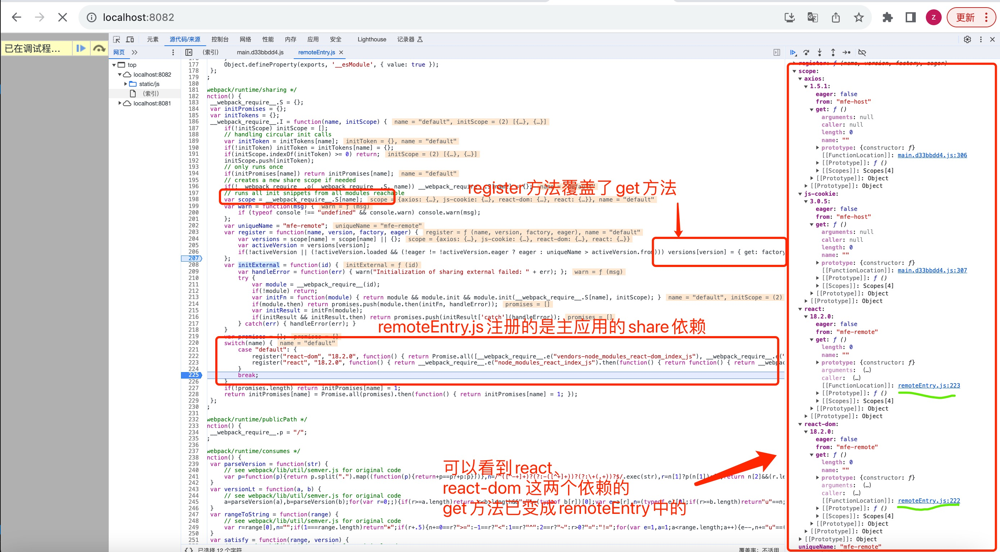

从上面的流程可以看出：子应用配置的 shared 依赖，会通过 register 注册到 sharedScope 里面，每个 sharedScope 里面的依赖都有一个 get 方法。默认情况下，这些 get 方法都是走的子应用的 main.js 的 get 方法，请求的是子应用打包后的 chunk 文件。但是，子应用请求主应用的 remoteEntry 后，remoteEntry.js 注册的是主应用的 shared 依赖，同时 remoteEntry.js 的 register 方法注册的是主应用的依赖，会覆盖掉子应用 shareScope 依赖里面的 get 方法，retemoEntry.js 的 get 方法请求的是主应用打包后的 chunk 文件。由于主应用只定义了 react、react-dom 这两个依赖，因此这两个依赖请求的是主应用的。而 js-cookie、axios 只有子应用定义了，因此请求的是子应用的。

> 具体的 register、get 方法加载模块的流程可以看源码。

### shared 共享依赖版本

默认情况下，子应用的依赖以子应用的版本为主。以下面的配置为例：

主应用 webpack 配置：

```js
output: {
  //...
  publicPath: '/', // publicPath会影响子应用加载远程脚本
  //...
}
//...
new ModuleFederationPlugin({
  name: "containerApp",
  filename: "remoteEntry.js",
  exposes: {
    "./Components": "./src/components/Button",
  },
  shared: {
    react: {
      singleton: true,
    },
    "react-dom": {
      singleton: true,
    },
    axios: {},
  },
});
```

子应用配置：

```js
new ModuleFederationPlugin({
  remotes: {
    container: "containerApp@http://localhost:8081/remoteEntry.js",
  },
  shared: {
    react: {
      singleton: true,
    },
    "react-dom": {
      singleton: true,
    },
    axios: {},
    "js-cookie": {},
  },
});
```

主应用和子应用都在 shared 里定义了 axios 依赖。两个应用打包后的产物如下：

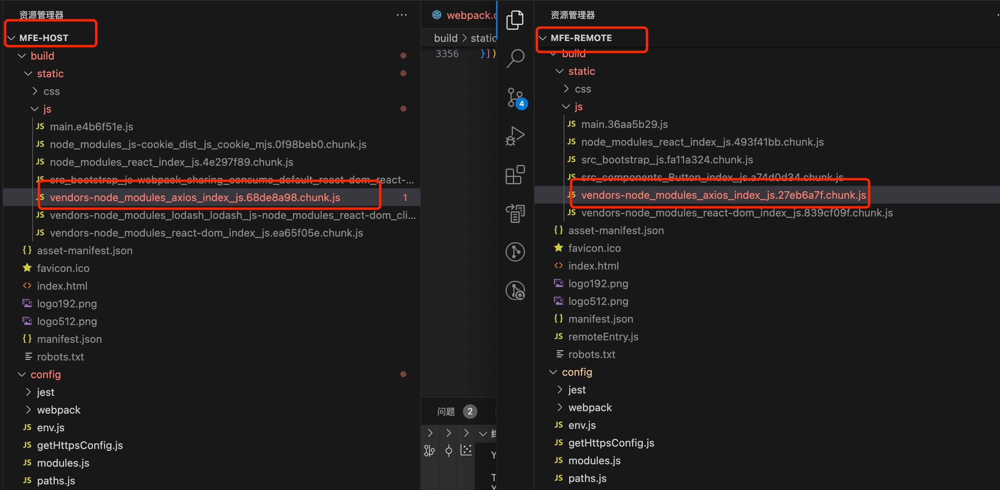

那么问题来了，子应用加载的是主应用的 axios chunk 文件还是子应用自身的 axios chunk 文件？

实际上，对于上面的配置而言，没有指定版本号的情况下，子应用加载的永远都是自身的 axios chunk 文件。下面以具体的例子说明

#### 场景一：主应用依赖版本比子应用高

主应用安装axios@1.5.1版本，子应用安装axios@1.0.0版本。查看子应用的源码，可以发现 findValidVersion 会根据子应用 shared 配置里面的版本号从 scope 中查找对应的 entry，由于我们没有指定版本，因此默认使用子应用的 package.json 里面的版本号。因此子应用加载的是自身的 axios chunk 文件。

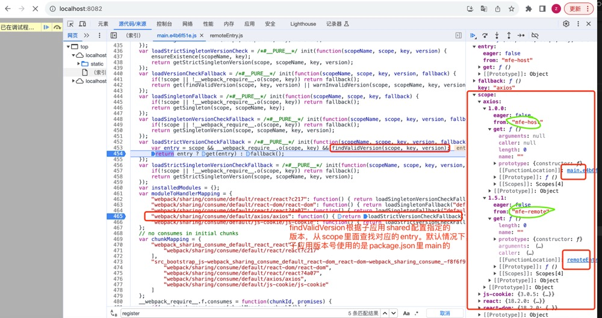

#### 场景二：主应用依赖版本比子应用低

主应用安装axios@1.0.0版本，子应用安装axios@1.5.1版本。可以看到，子应用加载的依旧是自身的 axios chunk 文件

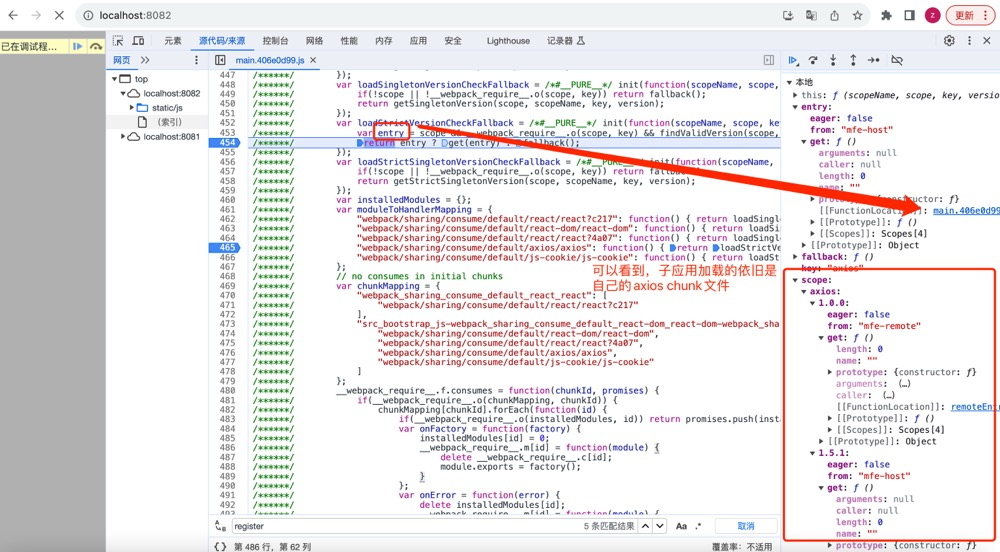

#### 场景三：主应用依赖版本与子应用相同

主应用安装axios@1.5.1版本，子应用安装axios@1.5.1版本

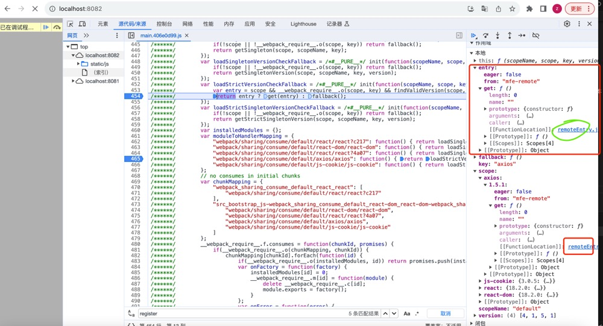

从图中可以看出，当主应用和子应用依赖版本相同时，子应用加载的是主应用的 axios chunk 文件，而不是自身的。通过浏览器 network 请求也可以看出：

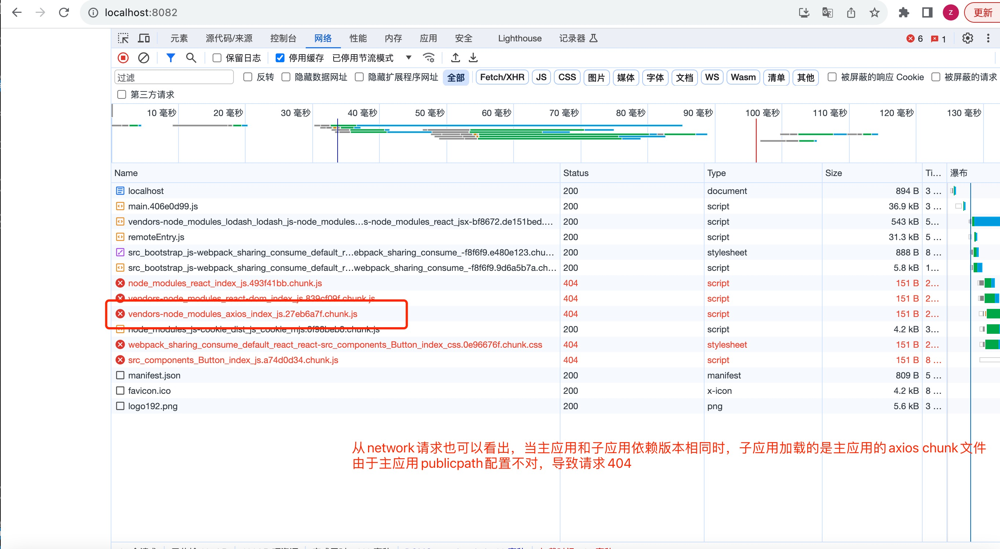

#### 场景四：主应用 shared 指定版本

实际上，在主应用 shared 配置里面指定版本是没什么意义的，对子应用的加载没啥影响。这次我们在主应用安装axios@1.5.1版本，子应用安装axios@1.0.0版本。同时配置如下：

主应用 webpack 配置：

```js
output: {
  //...
  publicPath: '/', // publicPath会影响子应用加载远程脚本
  //...
}
//...
new ModuleFederationPlugin({
  name: "containerApp",
  filename: "remoteEntry.js",
  exposes: {
    "./Components": "./src/components/Button",
  },
  shared: {
    react: {
      singleton: true,
    },
    "react-dom": {
      singleton: true,
    },
    axios: {
      requiredVersion: '^1.1.0',
    },
  },
});
```

子应用配置：

```js
new ModuleFederationPlugin({
  remotes: {
    container: "containerApp@http://localhost:8081/remoteEntry.js",
  },
  shared: {
    react: {
      singleton: true,
    },
    "react-dom": {
      singleton: true,
    },
    axios: {},
    "js-cookie": {},
  },
});
```

如果按照主应用配置的 shared 里面的 requiredVersion，按理子应用应该加载的是 1.5.1 版本号的 axios，即主应用的 axios chunk 才对，但实际情况并非如此。

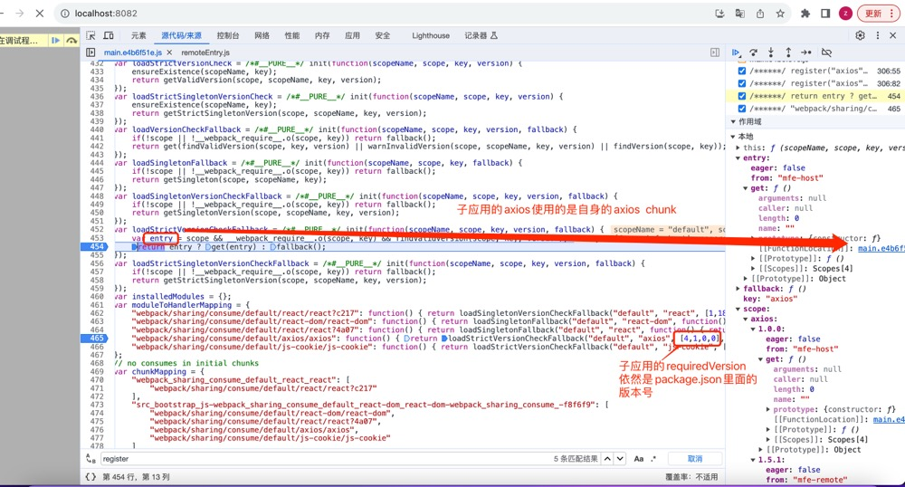

可以看到，主应用的 shared 指定版本不会影响子应用的 axios 加载逻辑，子应用依然加载的是自身的 axios chunk

#### 场景五：子应用 shared 指定版本

这次我们在主应用安装axios@1.5.1版本，子应用安装axios@1.0.0版本，同时在子应用 shared 指定 axios 版本，配置如下：

主应用 webpack 配置：

```js
output: {
  //...
  publicPath: '/', // publicPath会影响子应用加载远程脚本
  //...
}
//...
new ModuleFederationPlugin({
  name: "containerApp",
  filename: "remoteEntry.js",
  exposes: {
    "./Components": "./src/components/Button",
  },
  shared: {
    react: {
      singleton: true,
    },
    "react-dom": {
      singleton: true,
    },
    axios: {
      // requiredVersion: '^1.1.0',
    },
  },
});
```

子应用配置：

```js
new ModuleFederationPlugin({
  remotes: {
    container: "containerApp@http://localhost:8081/remoteEntry.js",
  },
  shared: {
    react: {
      singleton: true,
    },
    "react-dom": {
      singleton: true,
    },
    axios: {
      requiredVersion: "^1.1.0",
    },
    "js-cookie": {},
  },
});
```

由于子应用 shared 里面指定了 axios 的 requiredVersion，即版本号必须大于 1.1.0。由于子应用自身的依赖为 1.0.0，显然不满足要求，但是主应用的 axios 版本为 1.5.1，因此，这里子应用将会加载主应用的 axios chunk。

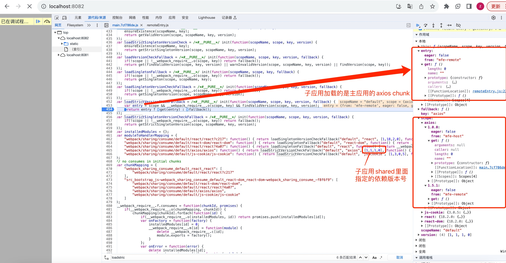

#### 场景六：子应用 shared 指定的版本不存在

这次我们在主应用安装axios@1.5.1版本，子应用安装axios@1.0.0版本，同时在子应用 shared 指定 axios 版本，配置如下：

主应用 webpack 配置：

```js
output: {
  //...
  publicPath: '/', // publicPath会影响子应用加载远程脚本
  //...
}
//...
new ModuleFederationPlugin({
  name: "containerApp",
  filename: "remoteEntry.js",
  exposes: {
    "./Components": "./src/components/Button",
  },
  shared: {
    react: {
      singleton: true,
    },
    "react-dom": {
      singleton: true,
    },
    axios: {
      // requiredVersion: '^1.1.0',
    },
  },
});
```

子应用配置：

```js
new ModuleFederationPlugin({
  remotes: {
    container: "containerApp@http://localhost:8081/remoteEntry.js",
  },
  shared: {
    react: {
      singleton: true,
    },
    "react-dom": {
      singleton: true,
    },
    axios: {
      requiredVersion: "^2.0.0",
    },
    "js-cookie": {},
  },
});
```

在子应用中指定 axios 的版本必须大于 2.0.0，但是由于主应用和子应用的版本号都不满足。因此子应用在加载时会走兜底的 fallback 逻辑，如下图所示，即子应用加载自身的 axios chunk 文件。

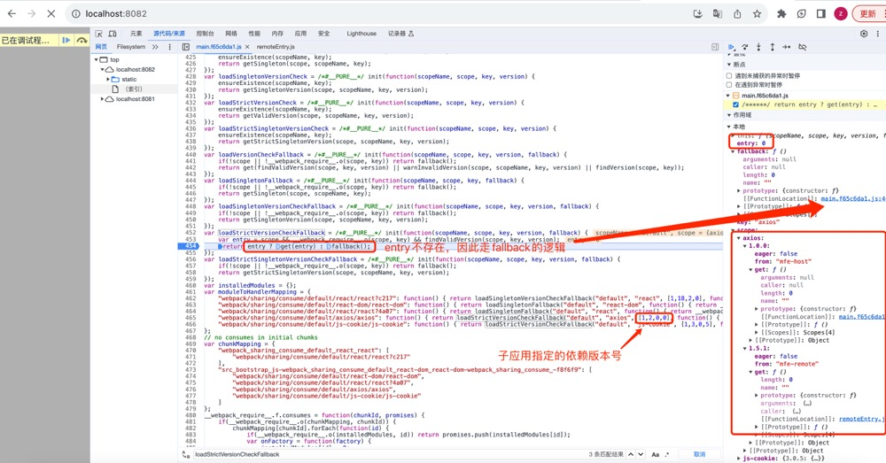

### publicPath

主应用的 publicPath 会影响子应用加载远程模块。在前面的例子中，主应用的 publicPath 都设置为'/'，因此子应用加载主应用提供的模块请求 404。

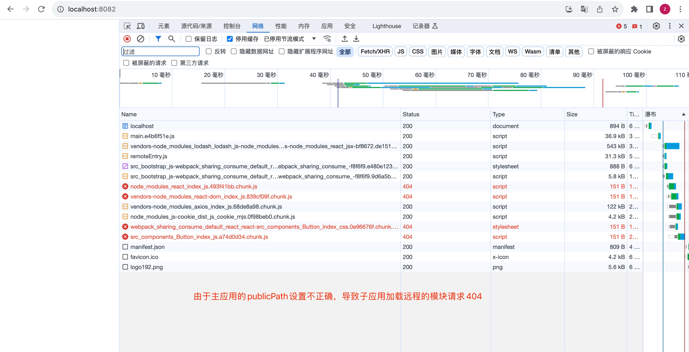

要搞清楚这个问题。我们需要了解一下远程模块的加载逻辑。我们前面讲到，sharedScope 里面每个依赖都有一个 get 方法，模块加载的入口就从这里开始。如下图所示：

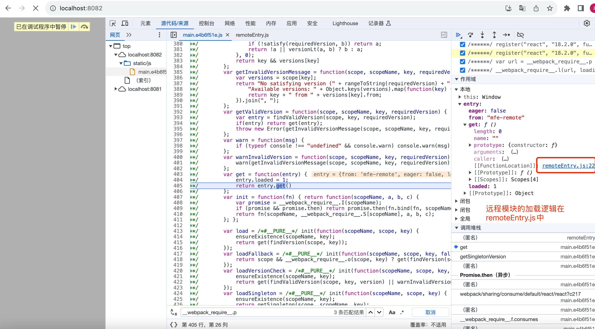

remoteEntry.js 中远程模块的加载逻辑如下：

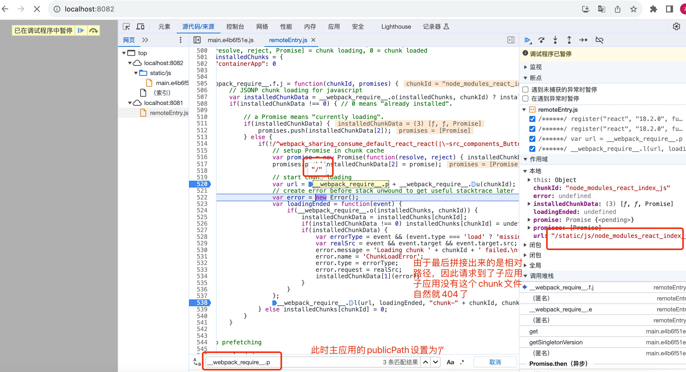

资源的拼接逻辑为：

```js
var url = __webpack_require__.p + __webpack_require__.u(chunkId);
```

可以看出最重要的是`__webpack_require__.p`的设置，这个值决定了最终的请求 url 是到哪个域名。接下来就看下主应用的 output.publicPath 的设置会对子应用远程模块的加载有啥影响

> 如果远程脚本请求 404，大概率是主应用的 output.publicPath 设置不正确导致的

#### 主应用不设置 output.publicPath

默认情况下，如果主应用不设置 output.publicPath 时，webpack 在构建阶段会往 remoteEntry.js 中注入设置 publicPath 的逻辑。这段逻辑主要是获取 remoteEntry.js 这个请求的域名，获取的结果就是主应用的域名

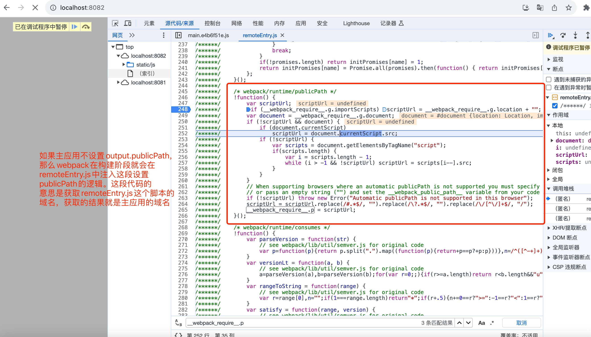

可想而知，此时子应用能够正确获取到远程模块

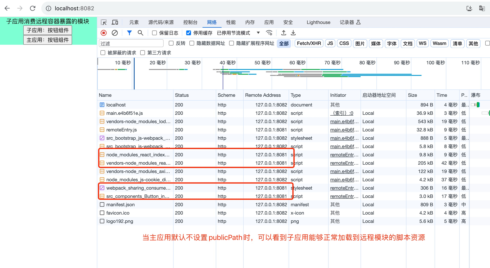

#### 主应用设置 output.publicPath 为主应用域名

当主应用设置 output.publicPath 为具体的值，webpack 在构建阶段会在 remoteEntry.js 中注入设置`__webpack_require__.p`

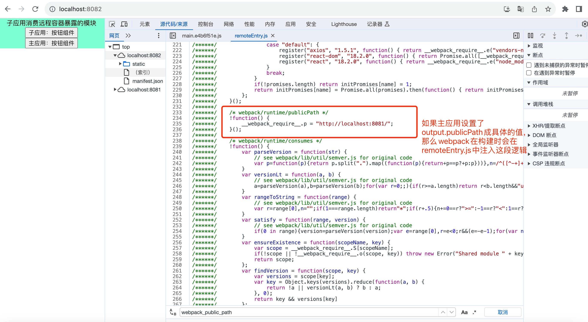

#### 主应用设置 output.publicPath 为 'auto'

实际上，设置 output.publicPath 为'auto'和不设置 output.publicPath 的效果一样。

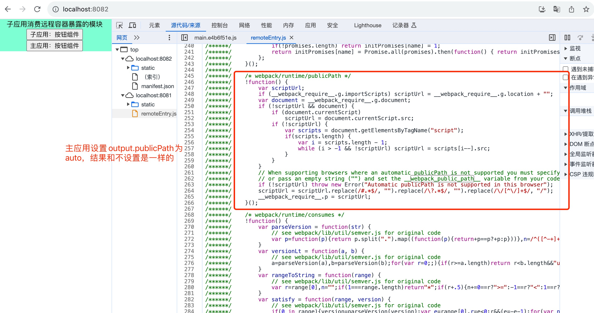

#### 从 remoteEntry 脚本中推断 publicPath

前面介绍的 publicPath 设置的例子中，不够灵活。在真实的业务场景中，主应用都会设置特定的 output.publicPath，而这又分为两种场景：

- 1.大部分情况下都是相对路径。如果设置成相对路径，对于主应用来说是比较友好的，因为不需要关注域名。但是对于子应用来说，此时加载远程模块就会导致脚本请求 404
- 2.小部分情况下设置成绝对路径，这种情况虽然能够解决子应用加载远程模块的问题，但也意味着子应用需要关注主应用的域名，如果主应用域名一旦发生变化，则所有子应用都需要更新，不够灵活。(当然，实际上子应用还是需要关注 remoteEntry 的域名的)

现在就介绍一种可以根据 remoteEntry 脚本的来源，动态设置子应用远程模块的 publicPath

修改主应用的 webpack 配置

```js
entry: {
  main: paths.appIndexJs,
  containerApp: paths.publicPathJs, // entry name必须和ModuleFederationPlugin一致
},
//...
new ModuleFederationPlugin({
  name: "containerApp", // 必须和entry入口名字一致
  filename: "remoteEntry.js",
  exposes: {
    "./Components": "./src/components/Button",
  },
  shared: {
    react: {
      singleton: true,
    },
    "react-dom": {
      singleton: true,
    },
    axios: {
      // requiredVersion: '^1.1.0',
    },
  },
});
```

同时，在主应用的src下新增一个`setup-public-path.js`文件

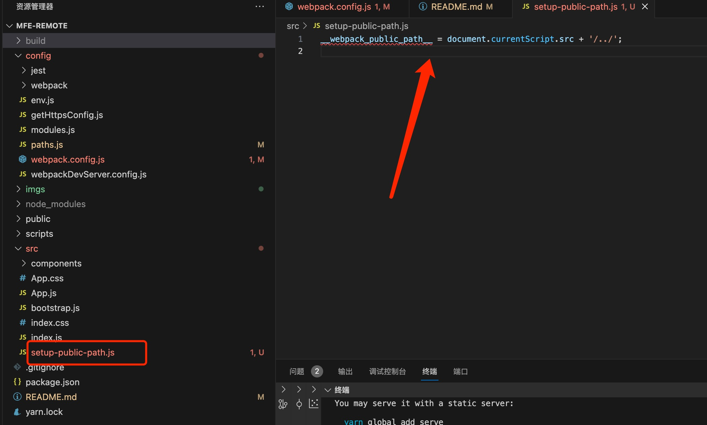

看下打包后的代码：

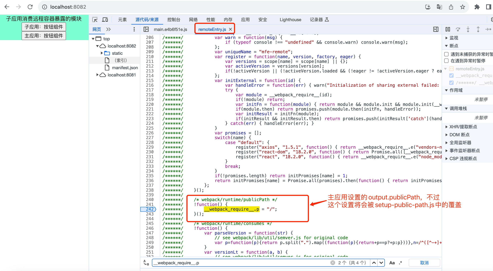

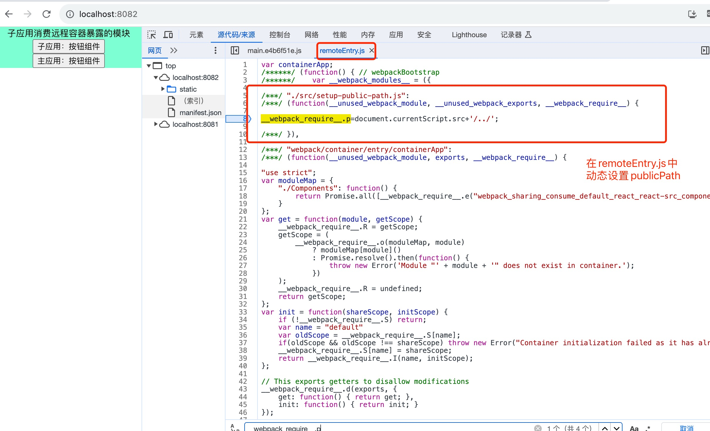

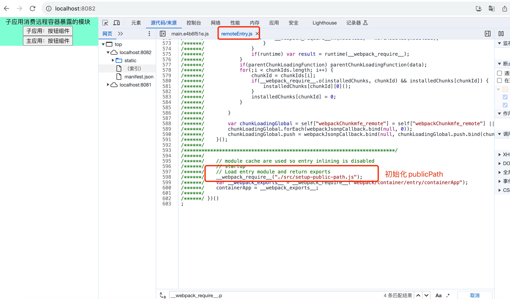


